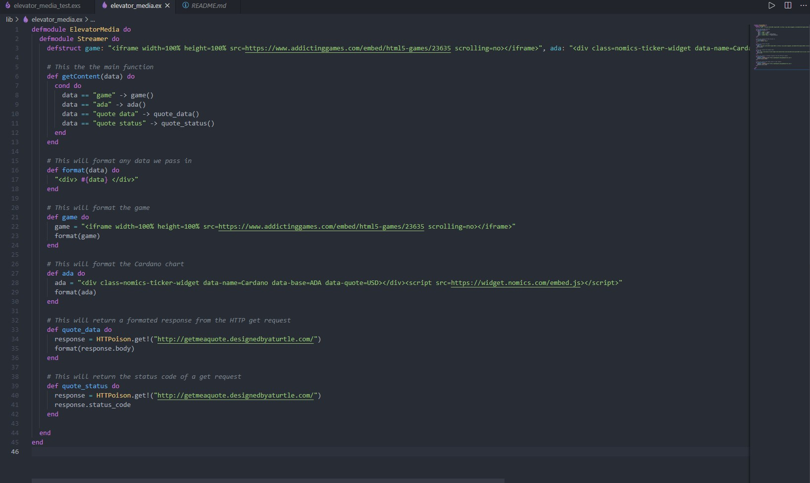
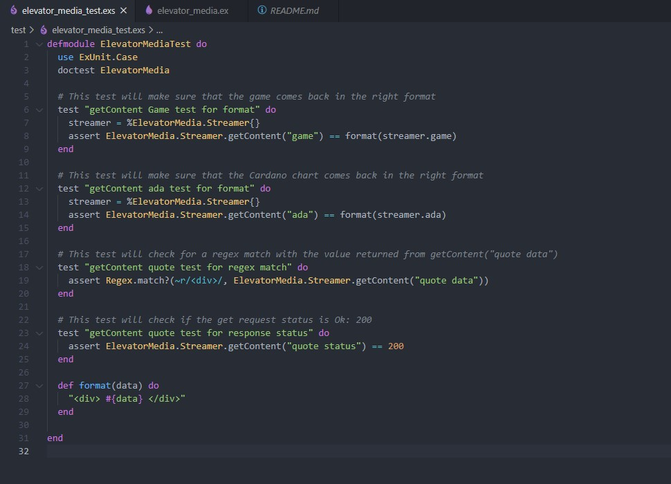
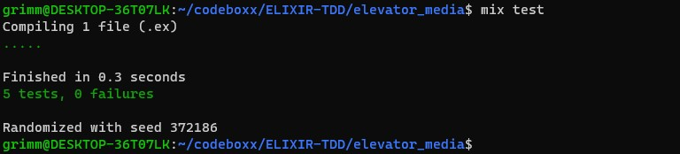

 
# TDD With Elixir

This is my second time attempting to learn Elixir, and I think that going throught TDD really helped me understand the language. 

In Elixir there are no classes. So in order to recreate the logic from ElevatorMedia, I had to use modules. Also, Elixir doesn't really like global variables or unused variables like other languages. Everything has to have a purpose. 

- The test files are located in " test/ "
- The modules are located in " lib/ "

**Nested Modules**

In Ruby, we can define a module, and a class inside of it. In Elixir, since there are only modules, we can do what we call a nested module:

**Tests**

For building our tests, we use ExUnit which is a testing framework for Elixir. The syntax is a bit different than Ruby, but the concept is the same.

